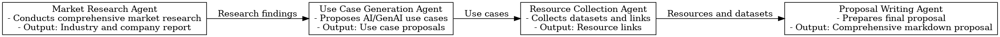

# AI/ML Proposal Generator - Multi-Agent System
> Multi-Agent system For Business Use-cases proposal
## Overview
This repository contains the implementation of a **Multi-Agent System** designed to generate AI and Generative AI (GenAI) use cases for a given company or industry. The system conducts market research, analyzes industry trends, proposes use cases, collects relevant resources, and prepares a final proposal. The agents work collaboratively to provide actionable insights aligned with the company’s strategic goals.

---

## Features

- **Market Research:** Research the given company and its industry, identifying key trends, strategic focus areas, and challenges.
- **Use Case Generation:** Propose innovative AI and GenAI use cases tailored to the company's needs.
- **Resource Collection:** Gather relevant datasets and resources from platforms like Kaggle, HuggingFace, and GitHub.
- **Final Proposal:** Deliver a well-structured, persuasive proposal including actionable recommendations and resource links.
- **Streamlit Integration:** User-friendly web interface for generating proposals interactively.

---

## Architecture Flow

The Multi-Agent System consists of the following agents:

1. **Market Research Agent**
   - Role: Conducts comprehensive market research.
   - Tools: Web search.
   - Output: Detailed report on the company's industry and key focus areas.

2. **Use Case Generation Agent**
   - Role: Proposes AI and GenAI use cases.
   - Tools: Web search.
   - Output: A markdown file containing use case proposals with detailed descriptions.

3. **Resource Collection Agent**
   - Role: Collects relevant datasets and links.
   - Tools: Web search, file saving.
   - Output: Markdown file with clickable resource links and usage instructions.

4. **Proposal Writing Agent**
   - Role: Prepares the final proposal.
   - Tools: File saving.
   - Output: A comprehensive markdown file summarizing findings and recommendations.

  

---

## Prerequisites

- **Python 3.9 or later**
- Required Python Libraries:
  - `streamlit`
  - `crewai`
  - `langchain`
  - `tavily`
  - `dotenv`
- API Keys:
  - Tavily API Key
  - Cerebras LLM API Key

---

## Installation

1. Clone the repository:
   ```bash
   git clone https://github.com/yourusername/FlowState.git
   cd ai-ml-proposal-generator
   ```

2. Install dependencies:
   ```bash
   pip install -r requirements.txt
   ```

3. Set up environment variables:
   - Create a `.streamlit/secrets.toml` file:
     ```toml
     [secrets]
     TAVILY_API_KEY = "your_tavily_api_key"
     CEREBRA_API_KEY = "your_cerebra_api_key"
     ```

4. Run the application:
   ```bash
   streamlit run main.py
   ```

---

## Usage

1. Open the Streamlit app in your browser.
2. Enter the company name and industry in the provided input fields.
3. Click the **Generate Proposal** button.
4. View the generated proposal and resource links in the app interface.

---

## Outputs

### 1. Generated Proposal
- A detailed markdown file containing:
  - Market research findings.
  - Proposed AI/GenAI use cases.
  - Actionable recommendations.
  - Clickable dataset resource links.

### 2. Resource Links
- A markdown file with:
  - Dataset descriptions.
  - Clickable resource links.
  - Usage instructions.

---

## Key Components

### Agents
- **Market Research Agent:** Collects industry and company-specific information.
- **Use Case Generation Agent:** Proposes practical and innovative AI/GenAI use cases.
- **Resource Collection Agent:** Fetches datasets and resources.
- **Proposal Writing Agent:** Creates a professional proposal with actionable insights.

### Tools
- **Web Search:** Powered by Tavily for advanced web searches.
- **File Saving:** Saves outputs in markdown format.

### Frameworks
- **CrewAI:** Multi-agent orchestration.
- **LangChain:** Tool integration and LLM interactions.
- **Streamlit:** Interactive web interface.

---


## Learning Resources

- **DeepLearning.AI Short Courses:**
  - [Multi-AI Agent Systems with CrewAI](https://www.deeplearning.ai/short-courses/multi-ai-agent-systems-with-crewai/)
  - [AI Agents in LangGraph](https://www.deeplearning.ai/short-courses/ai-agents-in-langgraph/)

- **RAG Agents Bootcamp:**
  - [Bootcamp Link](https://aiplanet.com/courses/rag-agents-bootcamp)

- **AutoGen Documentation:**
  - [AutoGen Docs](https://microsoft.github.io/autogen/docs/Getting-Started/)

---

## Acknowledgements

- **Tavily** for advanced web search capabilities.
- **Cerebras** for LLM services.
- **CrewAI** for multi-agent framework.

---

## Contributing

Contributions are welcome! Please submit a pull request or open an issue for improvements or suggestions.

